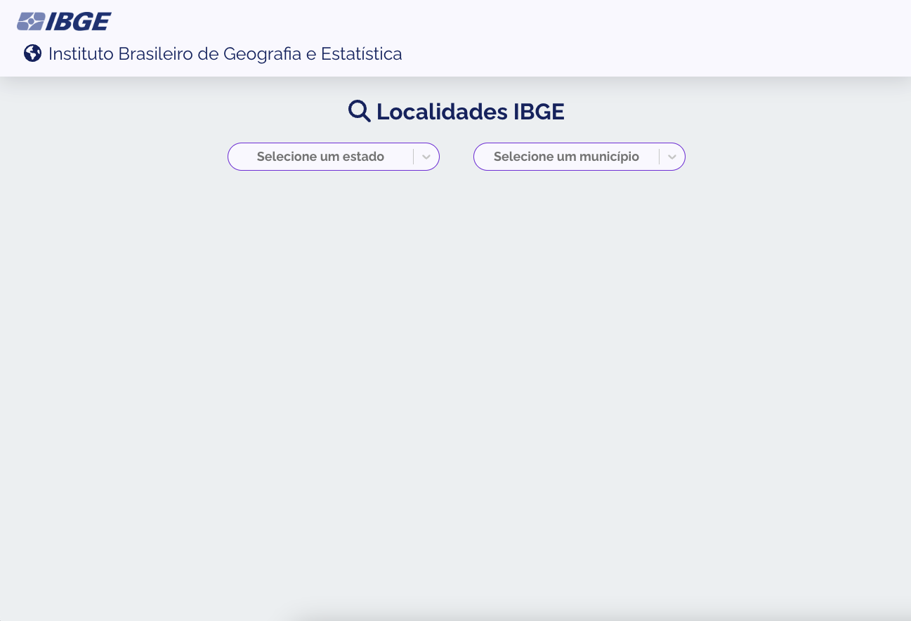
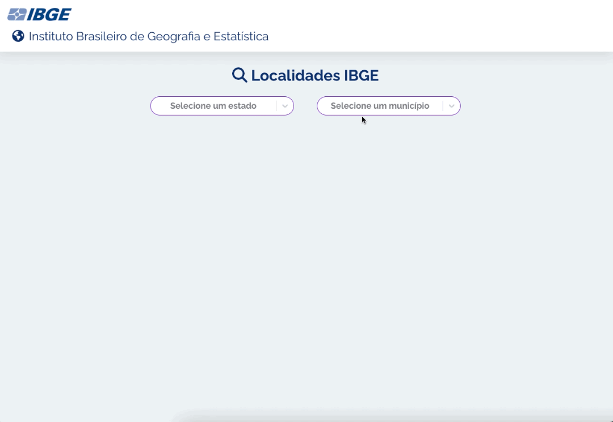
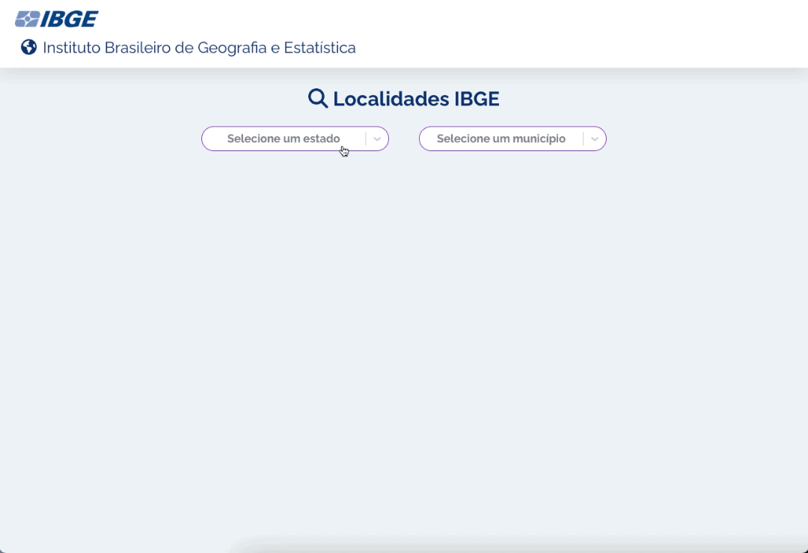

# SPA consumindo a API do IBGE

# Indice
#### 1. Descrição da aplicação e funcionalidades
#### 2. Ferramentas utilizadas
#### 3. Justificativa do design do projeto
#### 4. Como baixar/clonar e rodar o projeto

## 1.	Descrição da aplicação: 
Tem a finalidade de exibir dois selects na tela, um select de estados e o outro de municípios.

Ao clicar no select, é possível pesquisar ou selecionar um estado ou município. O select dos municípios só mostra as opções quando um estado é selecionado no primeiro select.

Depois de selecionar um estado e município vai ser exibido na tela os distritos daquele município, com as seguintes informações: nome do distrito, microrregião, mesorregião, UF e a região.

Caso o município tenha vários distritos, eles serão todos exibidos na tela. É possível retornar para o começo da aplicação utilizando um botão que fica visível na direita da tela quando o usuário rolar a página. Esse botão só aparece a partir de um ponto da rolagem da página.

Em caso de lentidão da internet ou demora da resposta da API, será mostrado na tela a frase “carregando...” até que o conteúdo seja totalmente carregado. 

A aplicação é responsiva e funciona bem em todos os tamanhos de tela.

## 2.	Ferramentas utilizadas
React, Redux, Redux toolkit, Javascript, styled component, React-select, react-scroll-to-top
Javascript juntamente com o React. O Fetch da API do IBGE foi realizado com o redux toolkit utilizando redux thunk. “O Redux Thunk é um middleware que permite chamar criadores de ação que retornam uma função em vez de um objeto de ação. Essa função recebe o método de expedição do armazenamento, que é usado então para expedir ações síncronas regulares dentro do corpo da função assim que as operações assíncronas forem concluídas.” Styled component foi utilizado para estilizar grande parte dos componentes da aplicação. React-select foi utilizado para estilizar e utilizar as funções de pesquisa nos selects. React-scroll-to-top foi utilizado para voltar para o topo da aplicação e também foi estilizado com o styled componente.

Citação do redux thunk: https://www.digitalocean.com/community/tutorials/redux-redux-thunk-pt

## 3.	Justificativa do design do projeto
A aplicação foi pensada para mostrar os dois selects na tela e as informações dos distritos e que seja possível visualizar em qualquer dispositivo de celular, tablet ou desktop.
A disposição dos componentes na tela foi pensada para ser uma aplicação intuitiva, fácil de utilizar e que também assemelha-se a aplicativos de celular.
O botão de voltar a página para o inicio foi pensado para facilitar a experiência do(a) usuário(a). Caso ele(a) precise ir até o final da lista de distritos, pode voltar para o topo da página com um simples clique no botão ao invés de rolar a página inteira de volta.
 
## 4.	Como baixar/clonar e rodar o projeto
1.	Clonar ou baixar o código do repositório
2.	Abrir o projeto dentro do Visual Studio Code (Vs Code)
3.	Instalar os pacotes utilizados no projeto no terminal com “npm install”
4.	Inicializar o projeto com o “npm start” no terminal